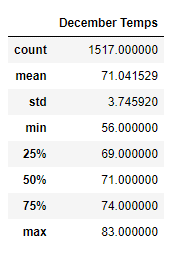
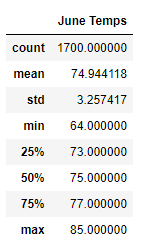

# Surfs_up
Sql Query with SQLalchemy, SQLite database, python, pandas, and Flask

## Overview
Our love of surfing and ice cream has led us to want to open a Surf and Shake shop to serve surfboards and icecream to locals and tourists. However, before doing so, our investor, W.Avy would like us to run some analytics on weather data he has from the island we want to open our shop in. More specifically, he has asked us to focus on the months of June and December, to determine if opening a surf shop is worth our time and if the surf and ice cream shop business is sustainable year-round.

## Results
We can view the summary statistics tables below to understand the differences between the temperatures in June and December:
    

As you can see from the statistics, there are a few minor, but key differences between the two months.
1. The average temperature in December is about 5 degrees cooler than in June. However ,this difference would not likely cause anyone to not buy an ice cream cone or want to go surfing!
   
2. The minimum temperature is 56 degrees in December while it is 64 degrees in June. However, 56 degrees may not be considered cold, especially in warmer Pacific waters, plus wearing a basic wetsuit could help the surfer maintain his/her body temperature. 

3. The maximum temperature is 83 degrees in December and 85 degrees in June. This shows that even in December this Island has some pretty warm (if not, hot) days! 

## Summary
Though December is definitely cooler than June, I think it is safe for us to go ahead and plan on opening up Surf and Shake in Oahu as its prime location! The weather year-round is warmly stable. And, even in December the average temperature is a nice 71 degrees, which is warm enough for ice cream and surfing. While there may be a few days where the temperature does dip down into the mid 50's, the average December temperature is still roughly the same as the average temperature in June. This definitely says it's time for our ice cream and surf shop to open!

### Additional Queries
Though our data provides good insight and helps us make a decision about opening up Surf and Shake, to appease our savvy investor, W.Avy, we may want to gather additional weather data for June and December to finalize our decision.

1. We could find the summary statistics from one specific station -- the one with the highest observations-- (as we did in our module work) to see if this would affect our results. ** Since we can see that there are roughly 200 less temperature readings in December than in June, so we want to be sure our data is valid.**

2. Additionally, we could find the summary statistics for precipitation (to determine rainfall amounts) for the months of June and December. We want to be sure we are not losing too much business due to heavy rains within these months (and when to push more business to compensate for those months if business is slow). 
